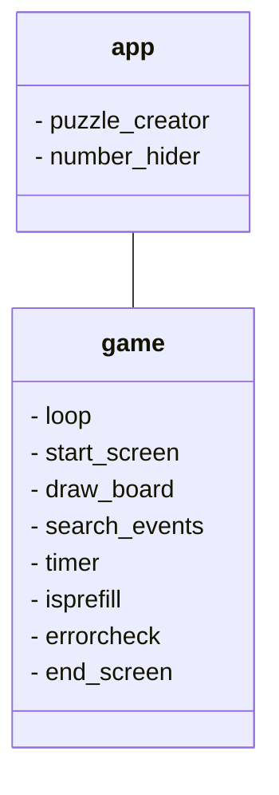
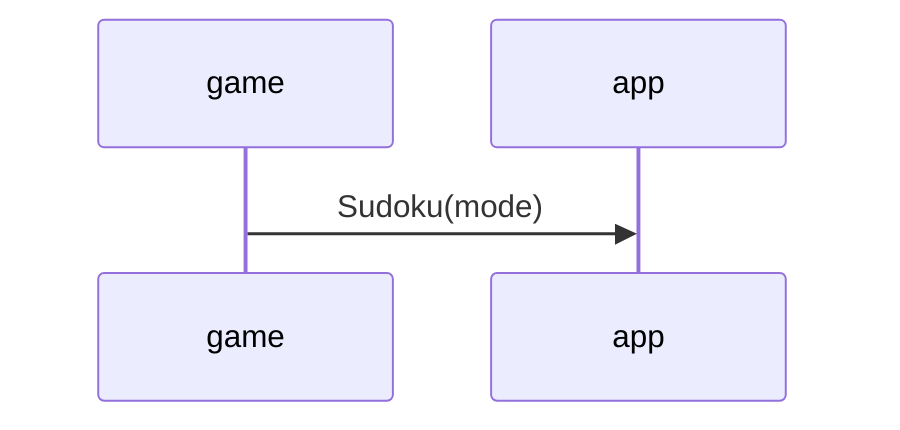
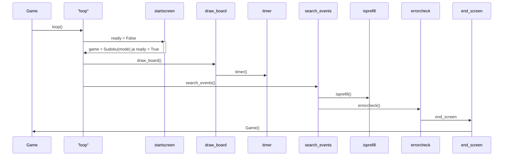

## Sovelluslogiikka

```mermaid
 classDiagram
    class app{- puzzle_creator
    - number_hider}
        app -- game
    class game{- loop
    - start_screen
    - draw_board
    - search_events
    - timer
    - isprefill
    - errorcheck
    - end_screen}
```
App luo pelilaudan ja pilottaa numerot. Game käyttää pelilautaa luodakseen pelin ja antaa käyttäjän pelata.

## Sekvenssikaavio

```mermaid
sequenceDiagram
    game ->> app: Sudoku(mode)
```
## Sekvenssikaavio game:in toiminnasta.

```mermaid
sequenceDiagram
    Game ->> "loop": loop()
    "loop" ->> startscreen: ready = False
    activate startscreen
    startscreen ->> "loop": game = Sudoku(mode) ja ready = True
    deactivate startscreen
    "loop" ->> draw_board: draw_board()
    draw_board ->> timer: timer()
    "loop" ->> search_events: search_events()
    search_events ->> isprefill: isprefill()
    search_events ->> errorcheck: errorcheck()
    errorcheck ->> end_screen: end_screen
    end_screen ->> Game: Game()
```

