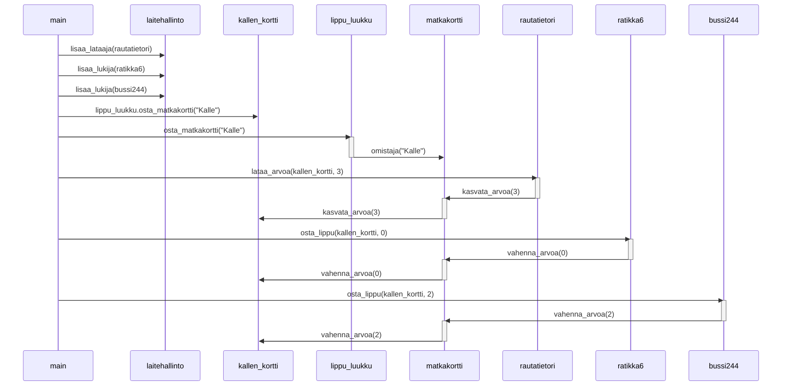

```mermaid
sequenceDiagram
    main ->> laitehallinto: lisaa_lataaja(rautatietori)
    main ->> laitehallinto: lisaa_lukija(ratikka6)
    main ->> laitehallinto: lisaa_lukija(bussi244)
    main ->> kallen_kortti: lippu_luukku.osta_matkakortti("Kalle")
    main ->> lippu_luukku: osta_matkakortti("Kalle")

    activate lippu_luukku
    lippu_luukku ->> matkakortti: omistaja("Kalle")
    deactivate lippu_luukku

    main ->> rautatietori: lataa_arvoa(kallen_kortti, 3)
    activate rautatietori
    rautatietori ->> matkakortti: kasvata_arvoa(3)
    deactivate rautatietori
    activate matkakortti
    matkakortti ->> kallen_kortti: kasvata_arvoa(3)
    deactivate matkakortti

    main ->> ratikka6: osta_lippu(kallen_kortti, 0)
    activate ratikka6
    ratikka6 ->> matkakortti: vahenna_arvoa(0)
    deactivate ratikka6
    activate matkakortti
    matkakortti ->> kallen_kortti: vahenna_arvoa(0)
    deactivate matkakortti

    main ->> bussi244: osta_lippu(kallen_kortti, 2)
    activate bussi244
    bussi244 ->> matkakortti: vahenna_arvoa(2)
    deactivate bussi244
    activate matkakortti
    matkakortti ->> kallen_kortti: vahenna_arvoa(2)
    deactivate matkakortti
```
