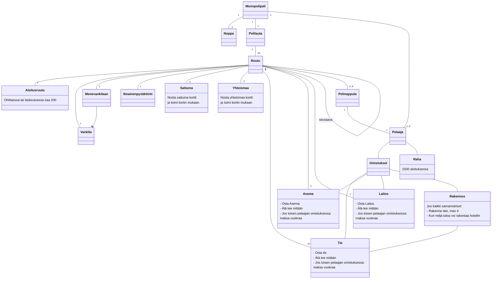

## Monopoli, luokkakaavio

```mermaid
 classDiagram
    Monopolipeli "1" -- "2" Noppa
    Monopolipeli "1" -- "1" Pelilauta
    Pelilauta "1" -- "40" Ruutu
class Aloitusruutu{Ohittaessa tai laskeutuessa saa 200}
    Ruutu -- "1" Aloitusruutu
    Ruutu -- "1" Vankila
    Ruutu -- "1" Mene vankilaan
    Ruutu -- "1" Ilmainen pysäköinti

class Sattuma{Nosta sattuma kortti
ja toimi kortin mukaan}
Ruutu -- "3" Sattuma

class Yhteismaa{Nosta yhteismaa kortti
ja toimi kortin mukaan}
Ruutu -- "3" Yhteismaa

class Tie{- Osta tie
- Älä tee mitään
- Jos toisen pelaajan omistuksessa:
  maksa vuokraa
}
Ruutu -- "22" Tie

class Asema{- Osta Asema
- Älä tee mitään
- Jos toisen pelaajan omistuksessa:
  maksa vuokraa
}
Ruutu -- "4" Asema

class Laitos{- Osta Laitos
- Älä tee mitään
- Jos toisen pelaajan omistuksessa:
  maksa vuokraa
}
Ruutu -- "2" Laitos

    Mene vankilaan --> Vankila
    Ruutu "1" -- "1" Ruutu : seuraava
    Ruutu "1" -- "0..8" Pelinappula
    Pelinappula "1" -- "1" Pelaaja
    Pelaaja "2..8" -- "1" Monopolipeli
    Pelaaja -- Omistukset
class Raha{1500 aloituksessa}
    Pelaaja -- Raha
    Omistukset -- Tie
    Omistukset -- Asema
    Omistukset -- Laitos
class Rakennus{Jos kaikki samanväriset:
- Rakenna talo, max 4
- Kun neljä taloa voi rakentaa hotellin
}
    Omistukset -- Rakennus
    Rakennus -- Tie
```
