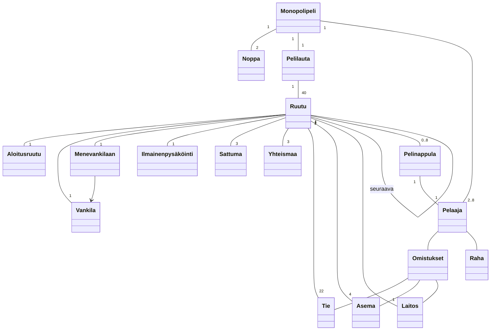

## Monopoli, alustava luokkakaavio

```mermaid
 classDiagram
    Monopolipeli "1" -- "2" Noppa
    Monopolipeli "1" -- "1" Pelilauta
    Pelilauta "1" -- "40" Ruutu
Ruutu -- "1" Aloitusruutu
Ruutu -- "1" Vankila
Ruutu -- "1" Mene vankilaan
Ruutu -- "1" Ilmainen pysäköinti
Ruutu -- "3" Sattuma
Ruutu -- "3" Yhteismaa
Ruutu -- "22" Tie
Ruutu -- "4" Asema
Ruutu -- "1" Laitos
Mene vankilaan --> Vankila
    Ruutu "1" -- "1" Ruutu : seuraava
    Ruutu "1" -- "0..8" Pelinappula
    Pelinappula "1" -- "1" Pelaaja
    Pelaaja "2..8" -- "1" Monopolipeli
Pelaaja -- Omistukset
Pelaaja -- Raha
Omistukset -- Tie
Omistukset -- Asema
Omistukset -- Laitos
```
